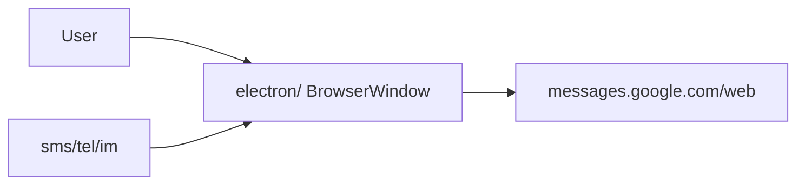

# Product Specification

> Spec-driven development stub for Google Messages for Desktop. Feature slices still use `docs/features/{name}.md`.
> Status markers: 🔲 open · ✅ done · ❌ blocked.

## Overview

**Product:** Google Messages for Desktop  
**Purpose:** Desktop wrapper for [Google Messages for Web](https://messages.google.com/web) on Windows, macOS, and Linux.  
**Users:** People who want SMS/RCS in a dedicated desktop window with `sms:` / `tel:` / `im:` compose.

## Functional Requirements & User Stories

| ID | Story | Acceptance |
|----|-------|------------|
| FR-1 | As a user I sign in to Messages for Web in the Electron shell | `persist:main` session; no UA spoofing |
| FR-2 | As a user I open `sms:` / `tel:` / `im:` links | Protocol handlers compose or focus the app |
| FR-3 | As a maintainer I run local gates before merge | `validate-bootstrap --quick` and `feature-gate --stack node` pass |

## Non-Functional Constraints

- MIT; dual copyright (see `LICENSE`)
- No proprietary SDKs on the FOSS production path
- Opt-in telemetry only; never enabled by default
- File budgets: 300 lines static data, 150 lines pure logic
- This Computer only — no Cursor Cloud Agents

## Architecture & Data Flow

Active work: `BUILD_PLAN.md`. Protocol details: `docs/WINDOWS_PROTOCOL_HANDLERS.md`.
